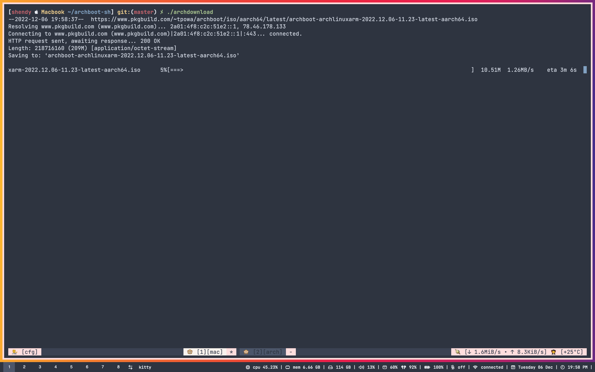

### ARCHBOOT ISO



Download iso file archboot with latest release \
-- archlinux-aarch64 (arm) \
-- archlinux-x86_64  (x86_64)

```install
curl https://raw.githubusercontent.com/shendypratamaa/archboot-sh/main/archdownload | sh
```

Require : - [curl](https://github.com/curl/curl) - [wget](https://www.gnu.org/software/wget/) - [fzf](https://github.com/junegunn/fzf)
